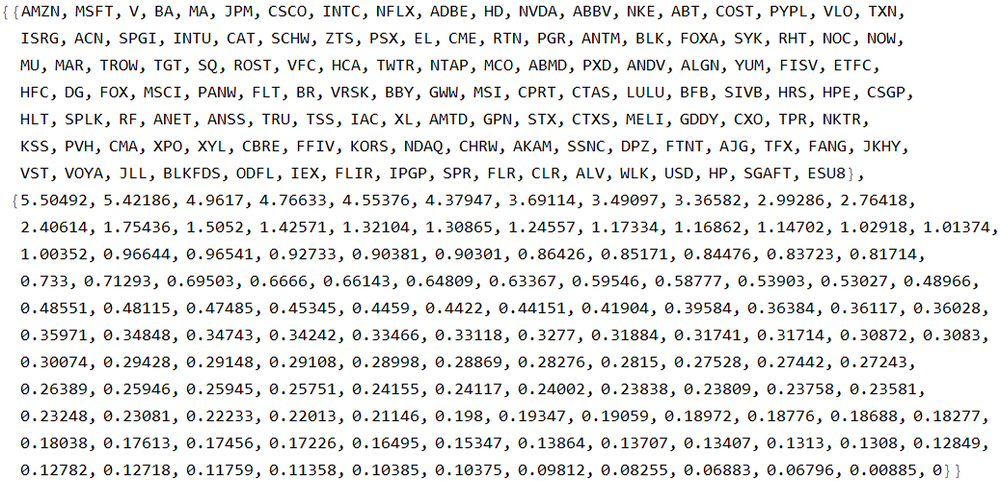
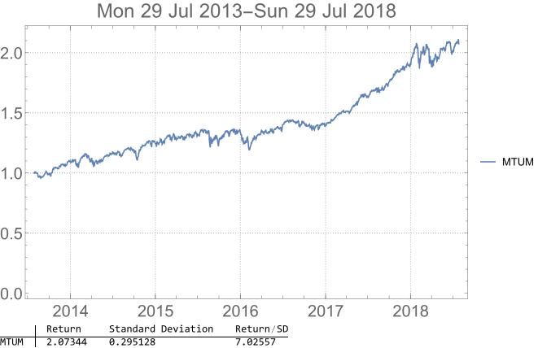

# Financial Charts in Mathematica

## Define functions for parsing data and charting

## Create a 5-year chart of the top 10 holdings of the iShares Edge MSCI USA Momentum Factor ETF (MTUM)

## The symbols and weights of the top 10 holdings fetched from the ETF's product page

## The portfolio chart of the top 10 holdings with simple analysis i.e. return, standard deviation and return/standard deviation (risk-adjusted return).

## Create a 5-year chart of all the equity holdings of the ETF. Note non-equity assets e.g. money market fund, cash, cash collateral and margins are removed.

## The symbols and weights of the equity holdings fetched from the ETF's product page

## The portfolio chart of the equity holdings with simple analysis i.e. return, standard deviation and return/standard deviation (risk-adjusted return).

## Create a 5-year chart of the ETF. Note the ETF's holdings change over time, so the performance of the portfolios formed of its current holdings may be very different from the performance of the ETF itself.

