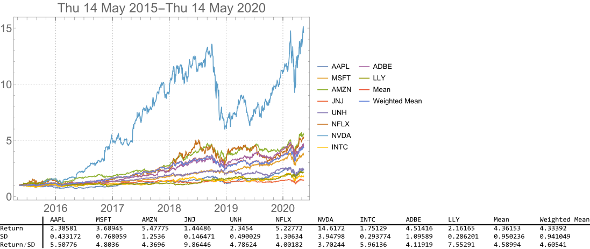

# Financial Charts in Mathematica

## 0. Define functions for parsing data and charting

## 1. Create a 5-year chart of the top 10 holdings of the iShares Edge MSCI USA Momentum Factor ETF (MTUM)

### 1.1 The symbols and weights of the top 10 holdings fetched from the fund's product page

### 1.2 The portfolio chart of the top 10 holdings with simple analysis i.e. return, standard deviation and return/standard deviation (risk-adjusted return).

## Note the fund's holdings change over time, so the performance of the portfolios constructed from its current holdings may differ from the performance of the fund itself.
