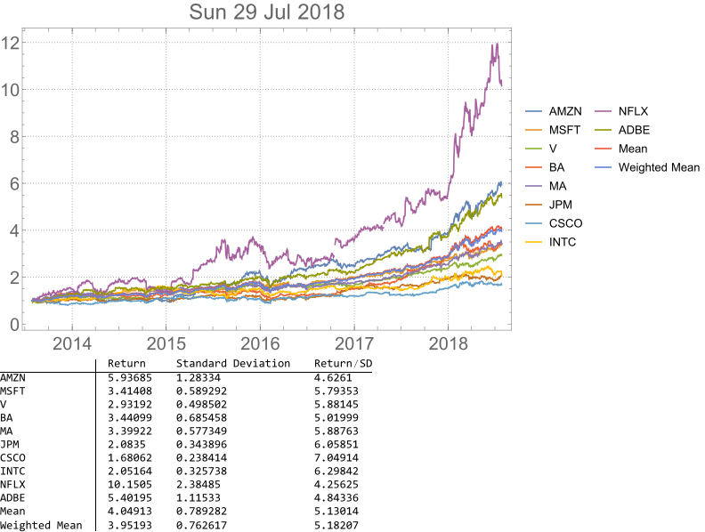

# Financial Charts in Mathematica

## Define functions for reading data and charting

## Create a 5-year chart of the top 10 holdings of iShares Edge MSCI USA Momentum Factor ETF (MTUM)

## The symbols and weights of MTUM's top 10 holdings

## The resultant portfolio chart and simple analysis e.g. return, standard deviation and return/standard deviation (risk-adjusted return).

